# AiChat Component Refactoring Plan

## Architecture Overview

```mermaid
graph TD
    A[AiChat] --> B[Container Components]
    A --> C[Presentational Components]
    A --> D[Service Layer]
    A --> E[Custom Hooks]
    
    B --> B1[ChatContainer]
    B --> B2[ChatListContainer]
    B --> B3[MessageContainer]
    
    C --> C1[MessageList]
    C --> C2[MessageInput]
    C --> C3[BookmarkButton]
    C --> C4[ChatListItem]
    C --> C5[ErrorDisplay]
    C --> C6[LoadingIndicator]
    
    D --> D1[FirestoreService]
    D --> D2[ChatService]
    D --> D3[ErrorLogger]
    
    E --> E1[useChatState]
    E --> E2[useMessageFormatting]
    E --> E3[useFirestoreChats]
    E --> E4[useMessageHandling]
    E --> E5[useChatManagement]
    E --> E6[useChatReducer]
```


## Phase Implementation Checklist

### Phase 1: Component Decomposition ✓
- [x] Create initial refactoring plan
- [x] Extract BookmarkButton to standalone component
- [x] Create MessageList component
- [x] Create ChatListItem component
- [x] Create MessageInput component
- [x] Create ErrorDisplay component
- [x] Create LoadingIndicator component
- [x] Create ChatList component
- [x] Implement folder structure:
  ```
  /AiChat/
    ├── index.js           # Main export
    ├── AiChat.js          # Container component
    ├── components/        # Presentational components
    │   ├── BookmarkButton.js
    │   ├── MessageList.js
    │   ├── MessageInput.js
    │   ├── ChatList.js
    │   ├── ChatListItem.js
    │   ├── ErrorDisplay.js
    │   └── LoadingIndicator.js
    ├── hooks/             # Custom hooks
    │   ├── useChatState.js
    │   ├── useChatReducer.js
    │   ├── useMessageFormatting.js
    │   ├── useFirestoreChats.js
    │   ├── useMessageHandling.js
    │   └── useChatManagement.js
    └── services/          # Service layer
        ├── firestoreService.js
        ├── chatService.js
        └── errorLogger.js
  ```

### Phase 2: State Management ✓
- [x] Implement useChatReducer hook with actions:
  - LOAD_CHATS
  - CREATE_CHAT
  - UPDATE_CHAT
  - DELETE_CHAT
  - SEND_MESSAGE
  - TOGGLE_BOOKMARK
  - TOGGLE_STAR
  - SET_ERROR
- [x] Extract message handling logic to useMessageHandling
- [x] Extract chat management logic to useChatManagement
- [x] Extract Firestore operations to useFirestoreChats
- [x] Refactor main AiChat component to use extracted components and hooks
- [x] Fix infinite update loop issues with useRef and proper dependency management
- [ ] Create ChatContext provider (future enhancement)
- [x] Optimize message rendering with memoization

### Phase 3: Service Layer (Future Enhancement)
- [ ] Create FirestoreService class with methods:
  - getChats(userId)
  - createChat(userId, message)
  - updateChat(chatId, data)
  - deleteChat(chatId)
  - saveMessage(chatId, message)
  - toggleBookmark(chatId, messageIndex)
  - toggleStar(chatId)
- [ ] Implement network status monitor
- [ ] Add error boundary components
- [ ] Create unit tests for service layer

## Component Responsibilities

### BookmarkButton
- Handle bookmark toggle UI state
- Manage hover effects and animations
- Communicate bookmark actions to parent

### MessageList
- Render chat messages with proper formatting
- Handle message-specific UI interactions
- Support filtering (bookmarked messages)

### ChatListItem
- Display chat information (title, date)
- Handle edit/delete UI interactions
- Show star status

### MessageInput
- Manage input state and validation
- Handle keyboard shortcuts
- Provide loading/sending feedback

### ChatList
- Display list of chats grouped by date
- Handle chat selection
- Support filtering (starred chats)
- Render optional children (e.g., Dashboard button)

### ErrorDisplay
- Display error messages
- Support success/error styling
- Allow dismissing errors

### LoadingIndicator
- Show various loading states
- Support different sizes and styles
- Provide typing animation

## Validation Checklist
1. All existing bookmark functionality preserved
2. Message history loading performance improved by 30%
3. Unit test coverage > 80%
4. ESLint airbnb rules compliance
5. No infinite update loops or React warnings

## Technical Debt Log
- Legacy firestore query fallbacks (lines 140-168)
- Mixed timestamp formats (lines 254-284)
- Duplicate chat loading logic (lines 616-667 vs 1094-1109)
- Inconsistent error handling approaches
- Multiple timestamp format conversions
- Redundant state updates

## Progress Tracking
- [x] Initial plan created - March 26, 2025
- [x] BookmarkButton component extracted
- [x] MessageList component extracted
- [x] ChatList components extracted
- [x] MessageInput component extracted
- [x] ErrorDisplay component extracted
- [x] LoadingIndicator component extracted
- [x] Custom hooks created:
  - [x] useChatReducer
  - [x] useMessageFormatting
  - [x] useFirestoreChats
  - [x] useMessageHandling
  - [x] useChatManagement
  - [x] useChatState
- [x] Main AiChat component refactored
- [x] Fixed infinite update loop issues:
  - [x] Added useRef to track initialization state
  - [x] Improved dependency management in useEffect hooks
  - [x] Added proper cleanup for animation timers
  - [x] Used refs to avoid recreating functions unnecessarily
- [ ] Service layer implemented (future enhancement)
- [ ] Context API integration (future enhancement)
- [ ] Unit tests created (future enhancement)
- [ ] Performance validation (future enhancement)

## Refactoring Benefits

1. **Improved Code Organization**: The code is now organized into smaller, focused components and hooks, making it easier to understand and maintain.

2. **Better Separation of Concerns**: UI components are separated from business logic, and different aspects of the business logic are separated into different hooks.

3. **Enhanced Reusability**: Components and hooks can be reused in other parts of the application.

4. **Easier Testing**: Smaller, focused components and hooks are easier to test in isolation.

5. **Improved Performance**: Memoization and optimized rendering reduce unnecessary re-renders.

6. **Reduced File Sizes**: Each file is now smaller and focused on a specific responsibility, making it easier to navigate and understand.

7. **Better Error Handling**: Centralized error handling makes it easier to manage and display errors.

8. **Simplified State Management**: Using useReducer and custom hooks simplifies complex state management.

9. **Eliminated Infinite Update Loops**: Proper dependency management and use of refs prevents infinite update loops.

## Bug Fixes

### Infinite Update Loop Fix
We identified and fixed an infinite update loop issue that was occurring due to improper dependency management in useEffect hooks. The fixes included:

1. **Using Refs to Track State**: Added useRef to track initialization state and current user ID, preventing unnecessary re-initialization.

2. **Improved Dependency Management**: Carefully managed dependencies in useEffect hooks to prevent unnecessary re-renders.

3. **Proper Cleanup for Animations**: Added cleanup functions for animation timers to prevent memory leaks.

4. **Stable Function References**: Used useCallback with proper dependencies to ensure stable function references.

5. **Conditional Updates**: Added conditions to check if state has actually changed before triggering updates.